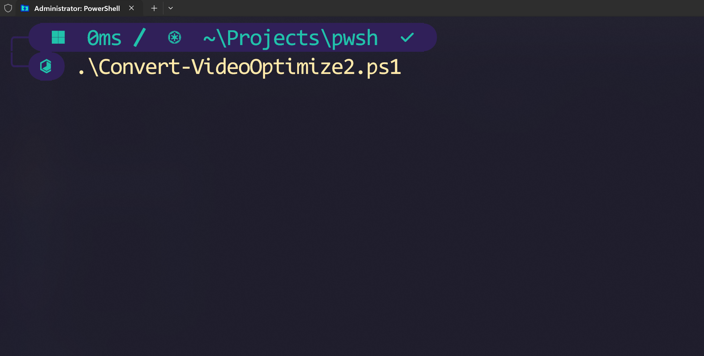
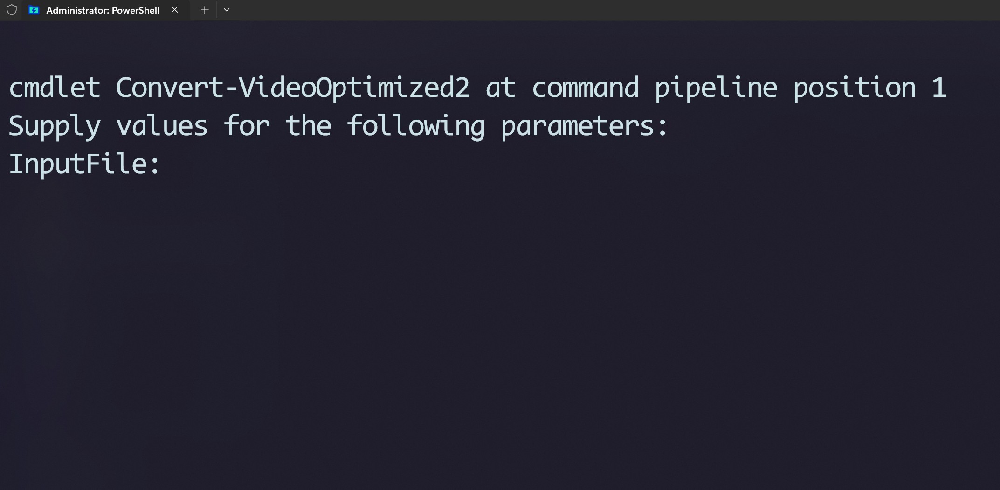
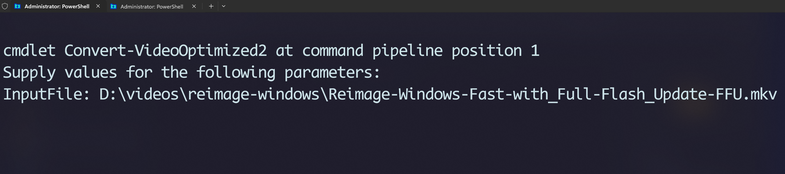
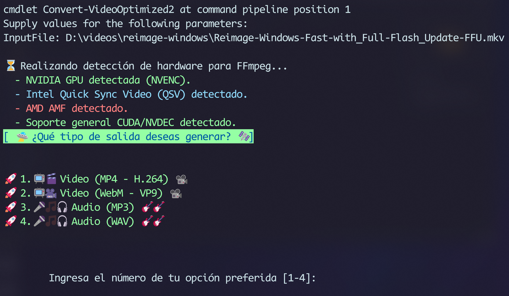
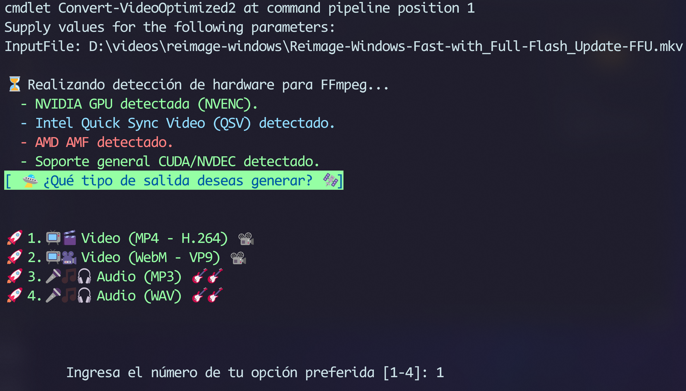
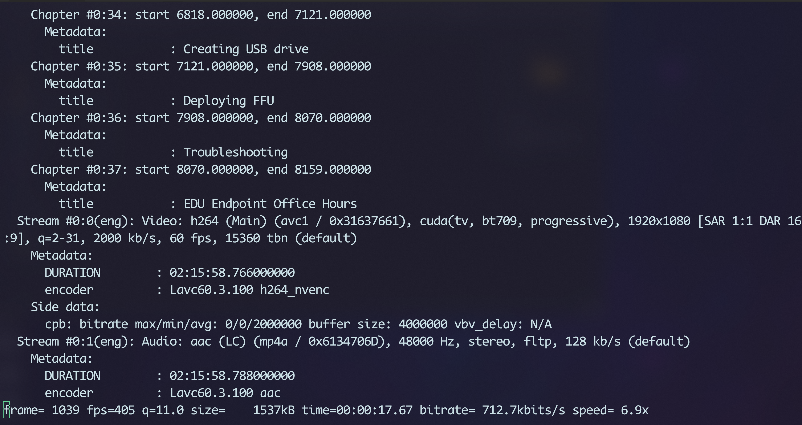

# Media-Convert: _Script de PowerShell para Conversión de Medios_

<br>

`Media-Convert.ps1` es un script de _PowerShell_ diseñado para simplificar la conversión de archivos de video y audio utilizando FFmpeg. 

Ofrece una interfaz interactiva en la consola para seleccionar el formato de salida y detecta automáticamente la aceleración de hardware disponible (específicamente NVIDIA NVENC) para optimizar el proceso de codificación.

<br>

## Ejecutar el script



<br>

## Se indica al usuario ingresar la ruta completa del archivo



<br>

## Se indica la ruta



<br>

## Se muestra a pantalla menu multi opcion para escoger



<br>

## Se escoge la conversion numero `1`



<br>

## Inicia la conversion



<br>


## ✨ Características Principales

*   **Menú Interactivo:** Guía al usuario a través de un menú simple para elegir el formato de salida deseado.
*   **Detección de Hardware:** Detecta automáticamente la presencia de GPUs NVIDIA para utilizar la codificación acelerada por hardware (NVENC), mejorando significativamente la velocidad de conversión. También informa sobre la presencia de Intel QSV y AMD AMF.
*   **Múltiples Formatos de Salida:**
    *   Video: MP4 (H.264), WebM (VP9)
    *   Audio: MP3, WAV
*   **Uso Sencillo:** Solo requiere especificar el archivo de entrada. El nombre del archivo de salida se puede generar automáticamente.
*   **Feedback Visual:** Utiliza texto con colores para una experiencia de usuario más clara y amigable.
*   **Flexible:** Construido para ser fácilmente extensible con nuevos formatos o codificadores.

## ⚙️ Requisitos Previos

1.  **PowerShell:** El script está diseñado para ejecutarse en un entorno de PowerShell en Windows (funciona tanto en Windows PowerShell 5.1 como en PowerShell 7+).
2.  **FFmpeg:** Debes tener FFmpeg instalado y su ejecutable (`ffmpeg.exe`) debe estar accesible a través del `PATH` del sistema.
    *   Puedes descargar FFmpeg desde su sitio web oficial. Se recomienda la versión "full build" de gyan.dev o BtbN.

## 🚀 ¿Cómo Usarlo?

1.  **Guarda el script:** Guarda el contenido del script como `Convert-VideoOptimized.ps1` en tu computadora.
2.  **Importante:** Abre el archivo `Convert-VideoOptimized.ps1` con un editor de texto y **elimina la última línea** (`Convert-VideoOptimized`). Esta línea es para pruebas y causará un error si se deja, ya que la función requiere parámetros.
3.  **Abre una terminal de PowerShell:** Navega hasta el directorio donde guardaste el script.
4.  **Permitir la ejecución de scripts (si es necesario):** Si es la primera vez que ejecutas un script local, es posible que necesites cambiar la política de ejecución de PowerShell. Puedes hacerlo para la sesión actual con el siguiente comando:
    ```powershell
    Set-ExecutionPolicy -ExecutionPolicy Bypass -Scope Process
    ```

5.  **Carga la función en PowerShell:** Utiliza "dot sourcing" para cargar la función en tu sesión actual.
    ```powershell
    . .\Convert-VideoOptimized.ps1
    ```

6.  **Ejecuta la conversión:** Llama a la función `Convert-VideoOptimized` con los parámetros necesarios. El script se encargará del resto.
    ```powershell
    # Conversión simple. El archivo de salida se generará automáticamente.
    Convert-VideoOptimized -InputFile "C:\Ruta\A\Tu\Video.mkv"

    # Especificando la ruta del archivo de salida.
    Convert-VideoOptimized -InputFile "C:\Videos\mi_video.mkv" -OutputFile "C:\Videos\convertido.mp4"
    ```

## 🔧 Parámetros

*   **-InputFile** (string, obligatorio): La ruta completa al archivo de video que deseas convertir.
*   **-OutputFile** (string, opcional): La ruta completa donde se guardará el archivo convertido. Si no se especifica, el script generará un nombre de archivo automáticamente en el mismo directorio que el archivo de entrada.

## 🛠️ Funcionamiento Interno

El script sigue estos pasos lógicos:

1.  **Validación:** Comprueba que el archivo de entrada especificado exista.
2.  **Detección de Hardware:** Ejecuta `ffmpeg -encoders` para buscar la disponibilidad del codificador `h264_nvenc`.
3.  **Selección de Codificador:** Elige `h264_nvenc` si está disponible para la codificación por hardware. De lo contrario, recurre a `libx264` para la codificación por software.
4.  **Construcción del Comando:** Ensambla dinámicamente los parámetros necesarios para FFmpeg en un array, incluyendo la aceleración de decodificación (`-hwaccel cuda`) si se usa NVENC.
5.  **Ejecución:** Llama a `ffmpeg` usando el operador de llamada (`&`) y el *splatting* de parámetros para pasar los argumentos de forma segura y muestra el resultado.

## 📄 Licencia

Este proyecto es de código abierto y se distribuye bajo la Licencia MIT. Siéntete libre de usarlo, modificarlo y distribuirlo.