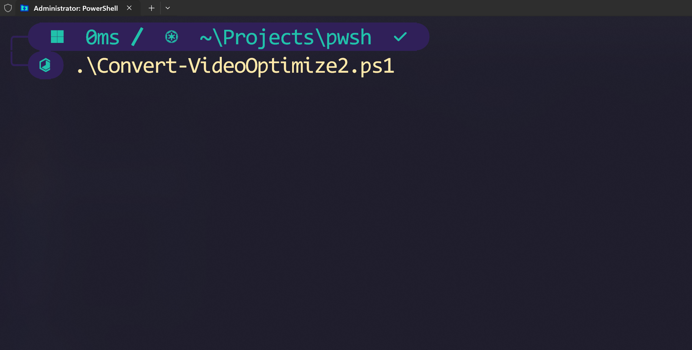
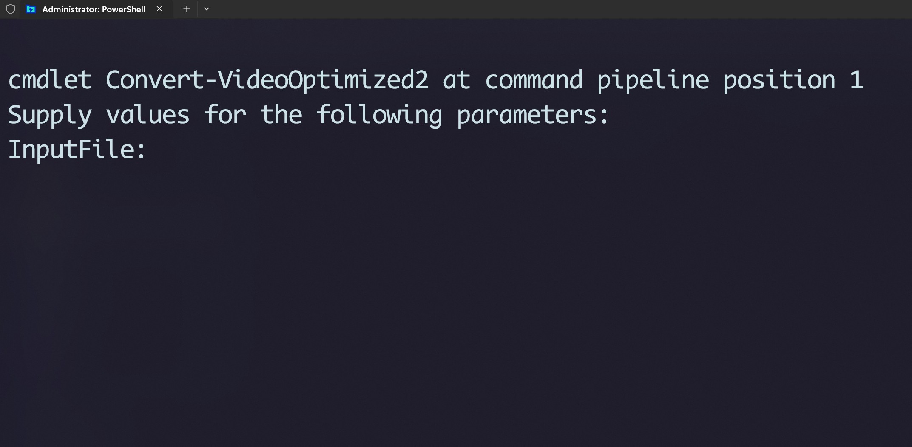
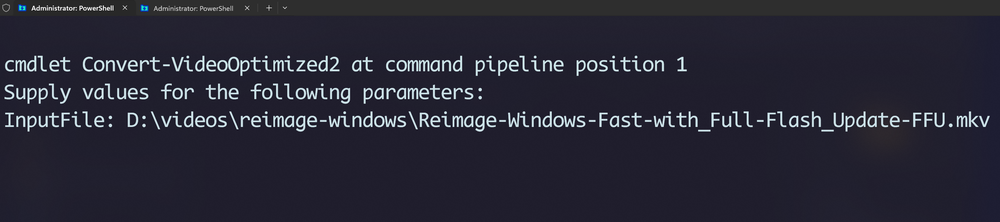
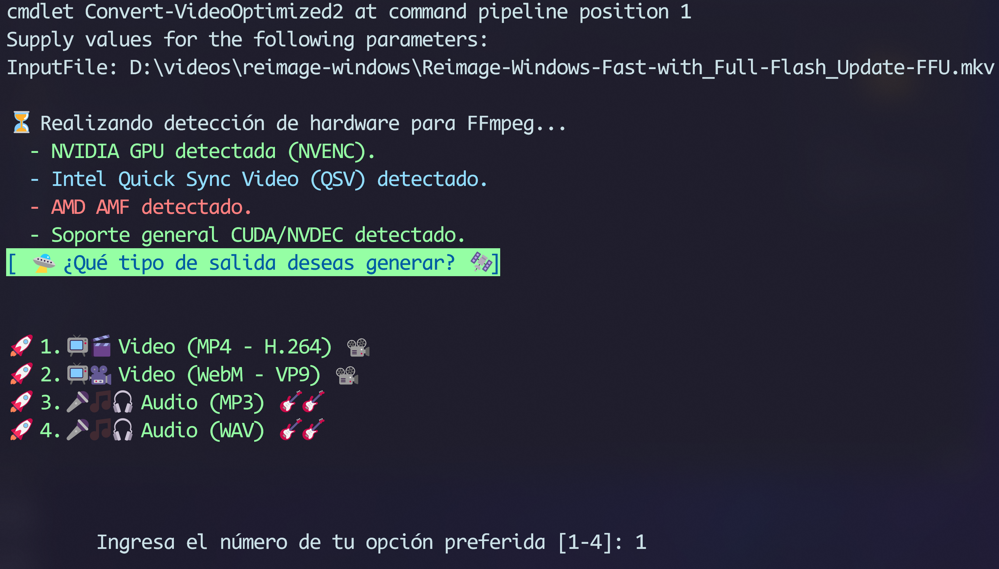
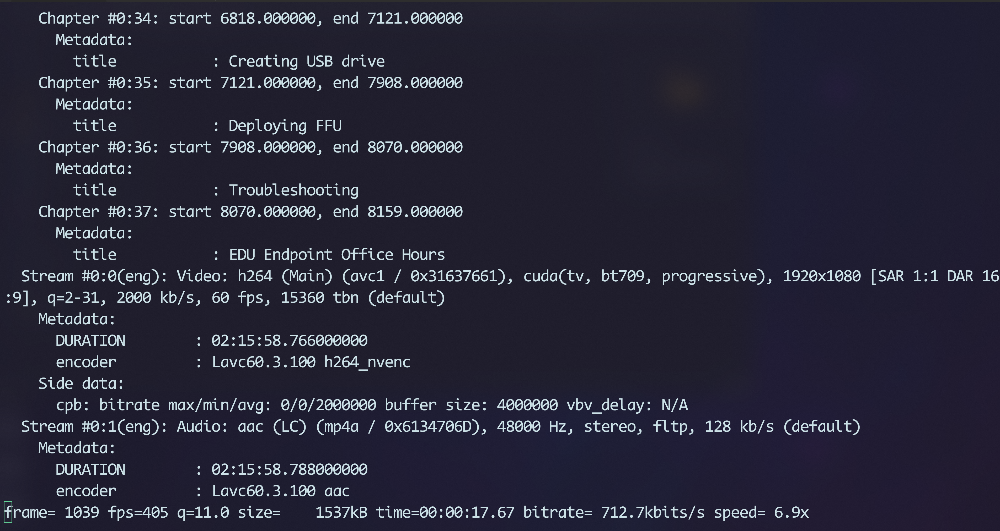

# Convert-VideoOptimized: Script de PowerShell para Conversión de Medios

---

`Convert-VideoOptimized` es un script de PowerShell diseñado para simplificar la conversión de archivos de video y audio utilizando FFmpeg. Ofrece una interfaz interactiva en la consola para seleccionar el formato de salida y detecta automáticamente la aceleración de hardware disponible (específicamente NVIDIA NVENC) para optimizar el proceso de codificación.

<br>

## Ejecutar el script



<br>

## Se indica al usuario ingresar la ruta completa del archivo



<br>

## Se indica la ruta



<br>

## Se muestra a pantalla menu multi opcion para escoger


<br>

## Se escoge la conversion numero `1`



<br>

## Inicia la conversion



<br>


## ✨ Características Principales

*   **Menú Interactivo:** Guía al usuario a través de un menú simple para elegir el formato de salida deseado.
*   **Detección de Hardware:** Detecta automáticamente la presencia de GPUs NVIDIA para utilizar la codificación acelerada por hardware (NVENC), mejorando significativamente la velocidad de conversión. También informa sobre la presencia de Intel QSV y AMD AMF.
*   **Múltiples Formatos de Salida:**
    *   Video: MP4 (H.264), WebM (VP9)
    *   Audio: MP3, WAV
*   **Uso Sencillo:** Solo requiere especificar el archivo de entrada. El nombre del archivo de salida se puede generar automáticamente.
*   **Feedback Visual:** Utiliza texto con colores para una experiencia de usuario más clara y amigable.
*   **Flexible:** Construido para ser fácilmente extensible con nuevos formatos o codificadores.

## ⚙️ Requisitos Previos

1.  **PowerShell:** El script está diseñado para ejecutarse en un entorno de PowerShell en Windows (funciona tanto en Windows PowerShell 5.1 como en PowerShell 7+).
2.  **FFmpeg:** Debes tener FFmpeg instalado y su ejecutable (`ffmpeg.exe`) debe estar accesible a través del `PATH` del sistema.
    *   Puedes descargar FFmpeg desde su sitio web oficial. Se recomienda la versión "full build" de gyan.dev o BtbN.

## 🚀 ¿Cómo Usar el Script?

1.  **Guarda el script:** Guarda el contenido del script como `Convert-VideoOptimize2.ps1` en tu computadora.

2.  **Abre una terminal de PowerShell:** Navega hasta el directorio donde guardaste el script.

3.  **Permitir la ejecución de scripts:** Es posible que necesites cambiar la política de ejecución de PowerShell para poder ejecutar scripts locales. Puedes hacerlo para la sesión actual con el siguiente comando:
    ```powershell
    Set-ExecutionPolicy -ExecutionPolicy Bypass -Scope Process
    ```

4.  **Ejecuta el script:** Hay dos formas principales de usarlo.

    **Opción A: Modificando el archivo (más simple)**

    Al final del archivo `Convert-VideoOptimize2.ps1`, modifica la última línea para que apunte a tu archivo de video y luego ejecuta el script.

    ```powershell
    # Al final del archivo, reemplaza la ruta de ejemplo
    Convert-VideoOptimized2 -InputFile "C:\Ruta\A\Tu\Video.mkv"
    ```

    Luego, en la terminal, simplemente ejecuta:
    ```powershell
    .\Convert-VideoOptimize2.ps1
    ```

    **Opción B: Cargando la función (más flexible)**

    Carga la función en tu sesión actual de PowerShell y luego llámala con los parámetros que necesites.

    ```powershell
    # Cargar la función en la memoria de la sesión actual
    . .\Convert-VideoOptimize2.ps1

    # Llamar a la función con tu archivo de entrada
    Convert-VideoOptimized2 -InputFile "C:\Videos\mi_video_original.mkv"

    # También puedes especificar un archivo de salida
    Convert-VideoOptimized2 -InputFile "C:\Videos\mi_video_original.mkv" -OutputFile "C:\Videos\convertido.mp4"
    ```

5.  **Sigue las instrucciones:** El script detectará tu hardware y te pedirá que elijas un formato de salida. Ingresa el número correspondiente y presiona `Enter`. ¡Listo!

## 🛠️ Funcionamiento Interno

El script sigue estos pasos lógicos:

1.  **Validación:** Comprueba que el archivo de entrada especificado exista.
2.  **Detección de Hardware:** Ejecuta `ffmpeg -encoders` y `ffmpeg -decoders` para buscar cadenas de texto correspondientes a codificadores de hardware comunes (NVENC, QSV, AMF).
3.  **Interacción con el Usuario:** Muestra un menú de opciones de conversión y espera la selección del usuario.
4.  **Construcción del Comando:** Basado en la detección de hardware y la elección del usuario, ensambla dinámicamente los parámetros necesarios para FFmpeg en un array.
5.  **Ejecución:** Llama a `ffmpeg` usando el operador de llamada (`&`) y el *splatting* de parámetros para pasar los argumentos de forma segura, y finalmente muestra el resultado de la conversión.

## 📄 Licencia

Este proyecto es de código abierto y se distribuye bajo la Licencia MIT. Siéntete libre de usarlo, modificarlo y distribuirlo.